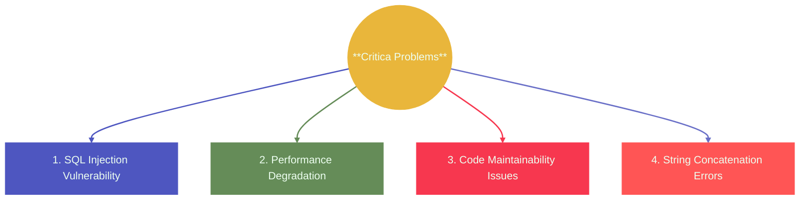

# 🔥 JDBC Dynamic Statement (Concatenated String Queries)

### ❌ Dangerous | 🐢 Slow | 🛑 Old Style | ⚠ Not Recommended

---

### ✅ 1. What is a Dynamic Statement in JDBC?

- A ***dynamic statement*** is an SQL query created by joining strings at runtime (mostly using + operator).
- t is called **dynamic** because the **SQL query is not fixed**.  
- The query is **constructed at runtime**, meaning it changes based on what the user or the program provides.
- This means the SQL command ***changes depending on user input.***

**Execution:**
```java
Statement stmt = connection.createStatement();
ResultSet rs = stmt.executeQuery(query);
```

**Example:**
```java
String username = userInput; 
String query = "SELECT * FROM users WHERE username = '" + username + "'";
ResultSet rs = stmt.executeQuery(query);
```

> The query is "dynamic" because its **content is determined at runtime** rather than being fixed.

---

### ⭐ Why called **“Dynamic”?**
The SQL is not predetermined — it varies based on:
- **User input**
- **Application variables**
- **Conditional logic**
- **Runtime state**

The **query structure itself changes** with each execution.

The SQL Changes with User Input  
Whatever the user types becomes part of the SQL query.

**Example:**  
User enters: `Rahul`  
→ SQL becomes: `SELECT * FROM users WHERE name='Rahul'`

User enters: `Sneha`  
→ SQL becomes: `SELECT * FROM users WHERE name='Sneha'`

The query is *different every time.*

---

### 🍕 Real-World Analogy (Dynamic Statement)

Think of a restaurant waiter who writes down **exactly what a customer says** without checking or filtering it:

**Customer:**  
"One pizza **OR give me all orders for free!**"

**Waiter:**  
Writes it down *word-for-word* on the order slip.

This is exactly how **dynamic statements** behave —

- They **blindly trust** whatever input they receive
- They **insert it directly** into the SQL
- They can lead to **catastrophic results** (just like giving away the entire restaurant's orders!)

Dynamic SQL = *The waiter who never checks what the customer is actually saying.*

---


#### 1. SQL Injection Vulnerability 🚨

**The Danger:** Attackers can inject malicious SQL code directly into queries.

#### 2. Performance Degradation 🐌

**Why it's slow :**
- Each query has a unique structure
- Database cannot cache execution plans
- Must parse, compile, and optimize every single time
- No query plan reuse
- Increased CPU and memory usage

> **Impact :** In high-traffic applications, this creates significant database bottlenecks.

#### 3. Code Maintainability Issues 🤯

Complex dynamic queries become unreadable:

```java
String query = "SELECT o.id, o.total, c.name FROM orders o " +
               "JOIN customers c ON o.customer_id = c.id WHERE " +
               "o.date >= '" + startDate + "' AND " +
               "o.date <= '" + endDate + "' AND " +
               "o.amount > " + minAmount + " AND " +
               "o.status = '" + status + "' AND " +
               "c.region = '" + region + "'";
```

**Problems :**
- Difficult to debug
- Error-prone during modifications
- Hard to test all combinations
- Easy to introduce syntax errors

#### 4. String Concatenation Errors 🔧

Minor mistakes break everything:

```java
// Missing closing quote
String query = "SELECT * FROM products WHERE name = '" + name;

// Missing space
String query = "SELECT * FROM orders WHERE" + "status = 'active'";

// Type mismatch
String query = "SELECT * FROM items WHERE price = '" + priceInteger + "'";
```

> Each error results in SQL syntax exceptions at runtime

---

### When Are Dynamic Statements Used?
Dynamic statements should be extremely rare in modern applications. Possible scenarios:

Legitimate Use Cases (with caution):
- Dynamic column names or table names (cannot be parameterized)
- Dynamic ORDER BY clauses (ASC/DESC from user selection)
- Quick debugging or one-off scripts (never in production)

Even then: Always validate and sanitize inputs rigorously.

---

## 🔥 Dynamic Statement vs PreparedStatement (JDBC)

| Feature                | Dynamic Statement        | PreparedStatement       |
|------------------------|---------------------------|---------------------------|
| **SQL Injection Risk** | ❌ Extremely high| ✅ Protected |
| **Performance**        | 🐌 Slow (no caching)       | ⚡ Fast (cached plans)    |
| **Query Plan Caching** | ❌ Never cached            | ✅ Always cached          |
| **Code Readability**   | ❌ Poor, messy strings      | ✅ Clean, structured      |
| **Type Safety**        | ❌ No validation            | ✅ Type-checked           |
| **Maintainability**    | ❌ Difficult                | ✅ Easy                   |
| **Database Load**      | ❌ High overhead            | ✅ Minimal overhead       |
| **Recommended**        | ❌ Never                   | ✅ Always                 |


